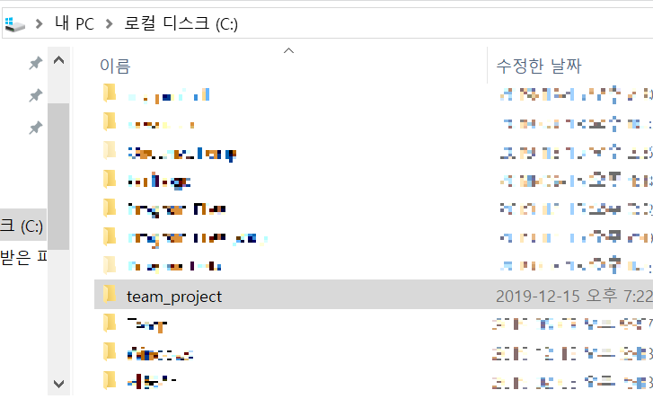
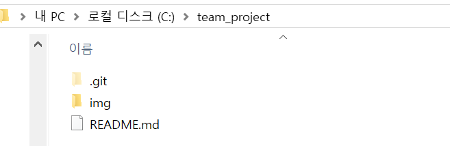

# team_project 매뉴얼
[마크다운 문법 참고 링크](https://heropy.blog/2017/09/30/markdown/)

[깃 사용법 참고 링크](https://medium.com/@joongwon/git-git-%EB%AA%85%EB%A0%B9%EC%96%B4-%EC%A0%95%EB%A6%AC-c25b421ecdbd)

## git 저장소 매뉴얼
### 1. 로컬 C드라이브에 'team_project' 폴더 생성

### 2. 생성한 폴더 안에 git bash 이용하여 프로젝트 내려받기(git clone)

> (명령어) git clone git@github.com:chohyeonK/team_project.git

### 3. visual studio code 다운 받고 git 프로젝트 연동하기
[git 연동 참고 주소](https://potensj.tistory.com/55)

### 4. 수정중! 커밋 테스트